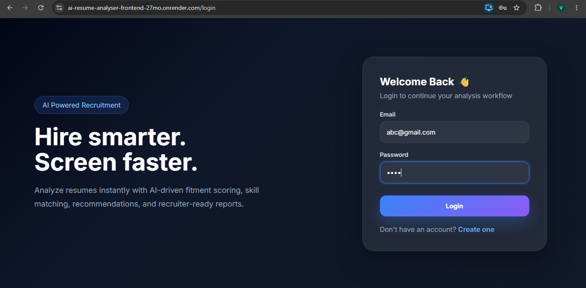
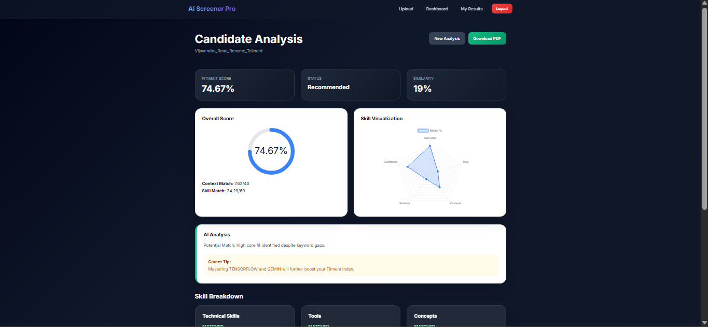
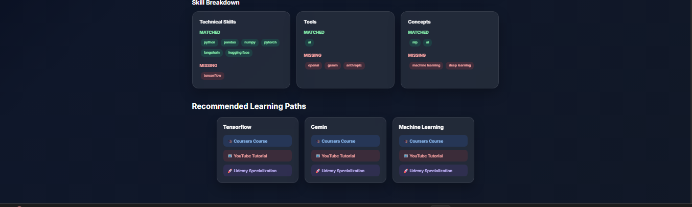
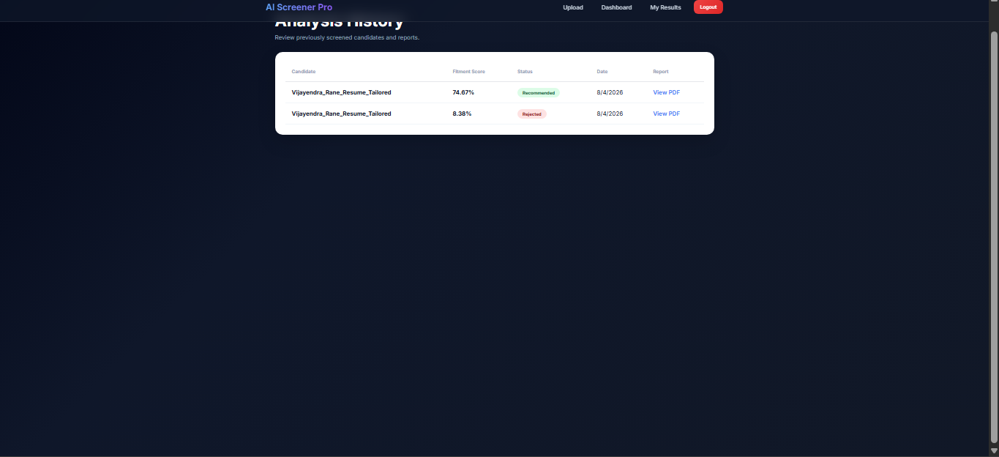

# 🚀 AI Resume Analyzer

An AI-powered Resume Screening Platform that leverages **Natural Language Processing (NLP)**, **Machine Learning**, and **Large Language Models (LLMs)** to intelligently evaluate resumes against job descriptions. The platform generates a comprehensive **Fitment Index**, predicts candidate shortlisting, identifies skill gaps, recommends learning resources, and produces recruiter-ready PDF reports.

---

## 🌐 Live Demo

**Frontend:** [https://your-frontend-url.onrender.com](https://ai-resume-analyser-frontend-27mo.onrender.com)

**Backend API:** [https://your-backend-url.onrender.com](https://ai-resume-analyser-backend-xyg3.onrender.com)

**API Documentation:** [https://your-backend-url.onrender.com/docs](https://ai-resume-analyser-backend-xyg3.onrender.com/docs)

---

## 📸 Screenshots

### 🔐 Secure Authentication
Modern login interface with JWT-based authentication and role-based access control for candidates and administrators.



---

### 🤖 AI Resume Analysis Dashboard
Comprehensive AI-powered candidate evaluation featuring Fitment Index, semantic similarity, skill visualization, confidence score, and personalized recommendations.



---

### 🧠 Skill Gap Analysis & Learning Recommendations
Detailed breakdown of matched and missing skills categorized by technical skills, tools, and concepts, along with curated learning resources.



---

### 📜 Resume Analysis History
Track previous resume evaluations, view fitment scores, shortlist status, and download recruiter-ready PDF reports.



# ✨ Features

## 👤 Candidate Portal

* Upload Resume (PDF/DOCX)
* Paste Job Description
* AI-powered Resume Parsing
* LLM-based Technical Skill Extraction
* Semantic Resume-JD Similarity Analysis
* Skill Gap Identification
* Fitment Index Calculation
* ML-based Shortlisting Prediction
* Confidence Score Generation
* Personalized Improvement Suggestions
* Course Recommendations for Missing Skills
* Download Recruiter-Ready PDF Report
* View Resume Analysis History

---

## 👨‍💼 Recruiter/Admin Portal

* Secure JWT Authentication
* Role-Based Access Control
* Candidate Analysis Dashboard
* View All Resume Analyses
* Download Candidate Reports
* Historical Resume Screening Records

---

# 🧠 AI & Machine Learning Pipeline

### Resume Processing

* Resume Text Extraction
* Text Preprocessing
* Skill Extraction using Llama 3 (Groq)
* Resume Normalization

### Resume Evaluation

* TF-IDF Vectorization
* Cosine Similarity
* Skill Matching Engine
* Skill Gap Analysis
* Fitment Index Calculation

### Machine Learning

A trained **Random Forest Classifier** predicts:

* Candidate Shortlisting
* Confidence Score

### Input Features

* Semantic Similarity
* Matched Skills
* Missing Skills
* Skill Match Percentage
* Resume Length

---

# 🏗️ Tech Stack

## Frontend

* React.js
* Axios
* React Router
* Chart.js
* CSS3

## Backend

* FastAPI
* SQLAlchemy
* JWT Authentication
* ReportLab
* Python

## Artificial Intelligence

* Llama 3 (Groq)
* NLP
* TF-IDF
* Cosine Similarity
* Scikit-learn
* Random Forest Classifier

## Database

* PostgreSQL

## Deployment

* Render
* GitHub

---

# ⚙️ System Architecture

```text
                     Resume (PDF/DOCX)
                            │
                            ▼
                  Resume Text Extraction
                            │
                            ▼
                AI Skill Extraction (LLM)
                            │
                            ▼
          Resume ↔ Job Description Comparison
                            │
          ┌─────────────────┼─────────────────┐
          ▼                 ▼                 ▼
  Semantic Similarity   Skill Gap      ML Prediction
          │                 │                 │
          └─────────────────┼─────────────────┘
                            ▼
                    Fitment Index Engine
                            │
          ┌─────────────────┼─────────────────┐
          ▼                 ▼                 ▼
      PDF Report     Recommendations     PostgreSQL
                            │
                            ▼
                  Candidate/Admin Dashboard
```

---

# 🔄 Workflow

1. User uploads a resume (PDF/DOCX).
2. Resume text is extracted and preprocessed.
3. Job Description is analyzed.
4. Llama 3 extracts technical skills from both resume and JD.
5. Resume and JD are compared using semantic similarity.
6. Skill Gap Analysis identifies matched and missing skills.
7. Machine Learning predicts whether the candidate is shortlisted.
8. A Fitment Index is calculated.
9. Personalized recommendations and learning resources are generated.
10. A recruiter-ready PDF report is created.
11. Analysis is stored in PostgreSQL.
12. Users can revisit previous analyses through the History dashboard.

---

# 📁 Project Structure

```text
AI-Resume-Analyser
│
├── backend
│   ├── api.py
│   ├── auth.py
│   ├── db.py
│   ├── similarity.py
│   ├── preprocess.py
│   ├── resume_parser.py
│   ├── skill_extractor.py
│   ├── report_generator.py
│   ├── recommendation.py
│   ├── model.pkl
│   └── requirements.txt
│
├── frontend
│   ├── public
│   ├── src
│   ├── package.json
│   └── .env
│
└── README.md
```

---

# 🔒 Authentication

* JWT Authentication
* Secure Password Hashing (bcrypt)
* Role-Based Access Control
* Candidate & Admin Dashboards

---

# 📄 PDF Report Includes

* Candidate Information
* Fitment Index
* Resume-JD Similarity Score
* Shortlisting Status
* Confidence Score
* Matched Skills
* Missing Skills
* Skill Gap Analysis
* AI Recommendations
* Suggested Learning Resources

---

# 🚀 Installation

## Backend

```bash
cd backend

pip install -r requirements.txt

uvicorn backend.api:app --reload
```

## Frontend

```bash
cd frontend

npm install

npm start
```

---

# 🔑 Environment Variables

## Backend (.env)

```env
DATABASE_URL=your_postgresql_connection_string
SECRET_KEY=your_secret_key
GROQ_API_KEY=your_groq_api_key
BASE_URL=https://your-backend.onrender.com
```

## Frontend (.env)

```env
REACT_APP_API_URL=https://your-backend.onrender.com
```

---

# 📊 Key Features

* 🤖 AI-powered Resume Screening
* 🧠 LLM-based Skill Extraction
* 📈 Machine Learning Shortlisting Prediction
* 📊 Fitment Index Calculation
* 🎯 Skill Gap Analysis
* 📚 Course Recommendations
* 📄 Automated PDF Report Generation
* 🔐 JWT Authentication
* 👨‍💼 Admin Dashboard
* 📜 Resume History Tracking
* ☁️ Cloud Deployment on Render

---

# 📌 Future Enhancements

* ATS Compatibility Score
* Resume Ranking Across Multiple Candidates
* Interview Question Generation
* Multi-language Resume Support
* Explainable AI Recommendations
* Cloud Storage for Reports (AWS S3)
* Email Notifications
* Recruiter Analytics Dashboard

---

# 📜 License

This project is developed for educational and portfolio purposes.

---

# 👨‍💻 Author

**Vijayendra Rane**

GitHub: https://github.com/Vijayendra2707

---

## ⭐ If you found this project useful, consider giving it a star on GitHub!
